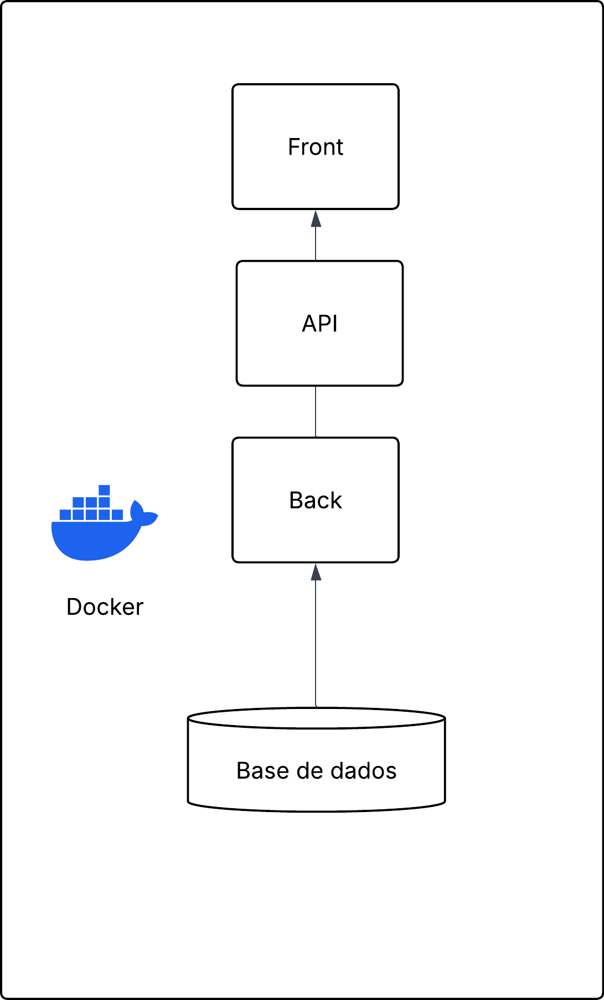

# Este projeto consiste na construção de um site de gerenciamento de tarefas para a matéria de Sistemas Distribuidos do curso de Gradução em Sistemas de Informação.

## Especificações do projeto

Implementar um sistema distribuído de gerenciamento de tarefas, com cliente e servidor separados, utilizando uma aplicação web simples.
O sistema permitirá que usuários autenticados criem e gerenciem suas próprias tarefas, enquanto o frontend se comunica com uma API REST desenvolvida separadamente no backend.

## Componentes da Aplicação
O sistema esta dividido em 3 partes independendes:
- Banco de Dados na Nuvem com Supabse utlizando PostgresQl
- Backend onde esta configurada API que comunica com frontend e Banco de Dadas PostgresQL
- Frontend onde é apresentada a interface para usuário utilizar as funcionalidades do sistema

Estrutura da Aplicação:
```
chowing/
├── client/
│   ├── src/                 # pasta onde esta os arquivos frontend em ReactJS + vite
│   ├── .dockerignore       # Arquivo de configuração para dockerignore
│   └──  Dockergile           # Contem a configuração para docker
|   |__ index.html            # contem a pagina onde roda o frontend
├── server/
│   └── routers/             # Rotas para autenticação e criação de tasks
|   |__ config.py             # Arquivo de configuração de conexão com banco de dados na nuvem
|   |__ database.py          # Cria sessão do banco de dados para usar na api
|   |__ main.py             # arquivo raiz da api
|   |__ models.py           # criar tabelas do banco de dados
|   tests/
|   |__conftest.py          # criar configuração dos teste
|   |__test_auth.py         # testes de autenticação
|   |__test_tasks.py        # testes para rotas da api

```
## Tipo do Sistema Distribuido

Sistema Distribuído de Informação, especificamente no modelo Cliente-Servidor em arquitetura multicamadas

## Representação da estrutura
A estrutura esta contida dentro de um container docker dividindo o backend(server) do frontend(client) 
<p align="center">
  
</p>

## Transparência
O usuário não precisa saber de:
  - Diferenças entre acessar dados locais ou remotos;
  - Onde  o recurso está fisicamente;
  - Que outros usuários estão acessando o mesmo recurso ao mesmo tempo;
  - Falhas parciais do sistema;
  - Que o sistema pode crescer (mais usuários, mais nós) sem o usuário notar mudança de comportamento;

## Escalabilidade
Possiveis formas de escalar essa aplição
- Escalar de forma Horizontal  o client e o Backend.
- Escaler de forma vertical o Banco de Dados.

- ####  Backend (FastAPI) — Escalonamento Horizontal


  - Backend em FastAPI funciona como uma API REST stateless (sem estado em memória);
  - Subir múltiplas réplicas do container backend atrás de um balanceador de carga / proxy reverso (como Nginx, Traefik ou AWS ALB);

- #### Frontend (React + Vite) — Escalonamento Horizontal 

  - Em vez de rodar o servidor de desenvolvimento do Vite (npm run dev) em container, gera-se o build estático (npm run build) servido por Nginx distribuído ou diretamente em CDNs (Cloudflare, AWS CloudFront, Vercel), escalando globalmente a custo quase nulo.

- #### Banco de Dados (PostgreSQL / Supabase) — Escalonamento Vertical

  - Como o banco de dados esta em nuvem, aumentar o recursos seria uma opção adequada para escalar o banco de dados, aumentando recursos como: Aumentar CPU, memória RAM e I/O de disco da instância do Postgres/Supabase

## Frontend - Sistema de Tarefas

## Tecnologias
- React
- Vite
- Docker

## Como executar localmente

### Com npm
```bash
npm install
npm run dev
```

## Estrutura principal
- `src/` - código fonte do frontend
- `public/` - arquivos públicos
- `index.html` - página inicial
- `vite.config.js` - configuração do Vite
- `Dockerfile` - configuração para container

## Observações
O frontend foi configurado para rodar em modo de desenvolvimento dentro do container e expor a porta 5173.


## Backend - Sistema de Tarefas

### Tecnologias
- FastAPI
- SQLAlchemy
- PostgreSQL
- Supabase
- Pytest


## Como executar

### 1. Criar ambiente virtual
```bash
python -m venv .venv
source .venv/bin/activate   # Linux/macOS
.venv\Scripts\activate      # Windows
```

### 2. Instalar dependências
```bash
pip install -r requirements.txt
```

## Integração com Supabase/Postgres
O projeto já está preparado para usar:
- PostgreSQL local
- Banco remoto do Supabase